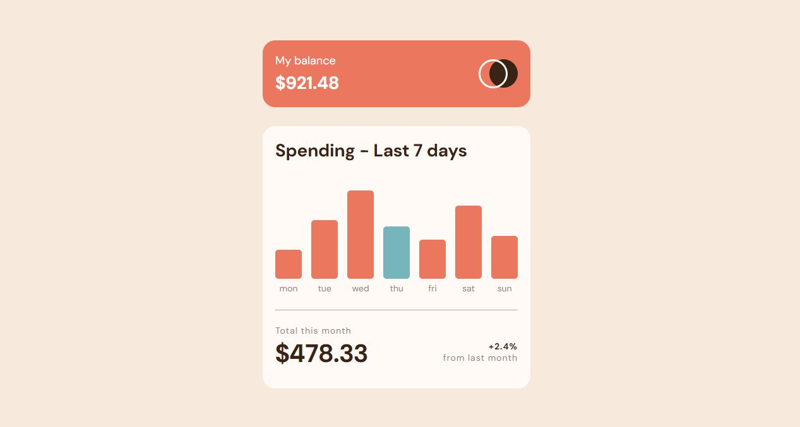

<h1 align="center">Expenses chart component
</h1>

 

   <a href="https://ahlam-alsaffarini.github.io/SignupForm/"> Demo 🔥🤍</a>

   Solution for a challenge from  <a href="https://www.frontendmentor.io/challenges/expenses-chart-component-e7yJBUdjwt/hub" target="_blank">frontendmentor.io</a>.

 
 

## Overview

### The challenge

This a challenge is to build out this bar chart component and get it looking as close to the design as possible.

THe user should be able to:

- View the bar chart and hover over the individual bars to see the correct amounts for each day
- See the current day's bar highlighted in a different colour to the other bars
- View the optimal layout for the content depending on their device's screen size
- See hover states for all interactive elements on the page

### Built with

- Semantic HTML5 markup
- CSS custom properties
- Flexbox
- Mobile-first workflow

### Useful resources

- [MDN](https://developer.mozilla.org/en-US/)
- [stackoverflow](https://stackoverflow.com/)

## Acknowledgments

this was a great challenge for me <3

A big thank you to anyone providing feedback on my . It definitely helps to find new ways to code and find easier solutions!
